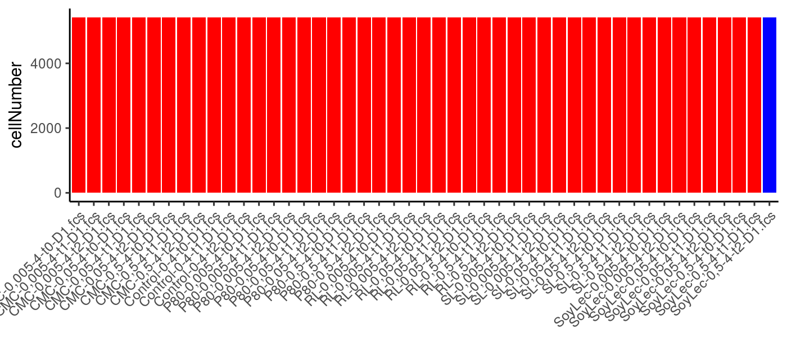
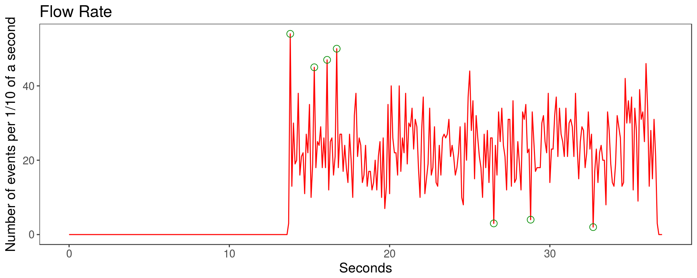
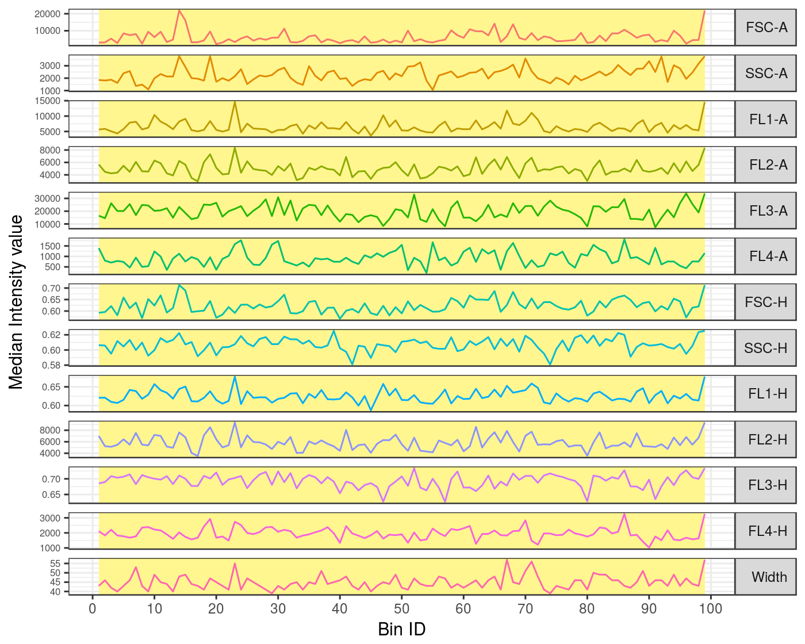

## FCS file information

> Input file name: SoyLec-0,5-4-t2-D1    
> Number of events: 5422



Comparison of the number of events stored in the FCS files of the entire dataset. In blue is highlighted the FCS file whose quality control analysis is described in this report. 

## Quality control analysis 

### Summary

> The anomalies were removed from:  Flow Rate, Flow Signal and Flow Margin  
> Anomalies detected in total: **3.78** %  
> Number of high quality events: 5217  


### Flow rate check

> **3.78** % anomalies detected in the flow rate check.




The plot reconstructs the flow rate with a resolution of 1/10 of a second. Anomalies in the flow rate are identified with an algorithm based on the generalied ESD outlier detection method. The anomalies are circled in green. 

### Signals acquisition check

> **0** % anomalies detected in the signal aquisition check. 




The more stable region selected consistent for all channels is highlighted in yellow. If the removal of outliers has been required before the execution of the changepoint analysis, the detected outliers are cicled in green.

The FCS file was divided in 99 bins, hence each bin contains 55 event(s). The stable region is located between the bins 1 and 99.

##### More info on the changepoints detected:

No changepoints were detected.  


Channels excluded from the analysis: FSC-A, SSC-A, FL2-A, FL4-A, FSC-H, SSC-H, FL2-H, FL4-H, Width. 
 
No changepoints were detected in the channels: FL1-A, FL3-A, FL1-H, FL3-H. 


### Dynamic range check

> **0** % anomalies detected in dynamic range check.  


##### More info on the anomalies detected in the dynamic range check:

for each channel, The table shows the number of events that did not pass the dynamic range check:


```
##              lower_range upper_range
## FL1-H                  0           0
## FL3-H                  0           0
## total_SUM              0           0
## total_UNIQUE           0           0
```
